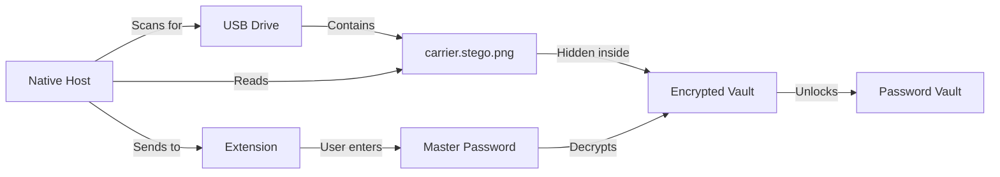

# 🔐 StegaPass - USB Steganographic Password Manager

An offline, USB-based password manager that uses steganography to hide your encrypted passwords inside PNG images.


## 🌟 Features

### Security
- **Offline Operation**: No internet connection required - your passwords never leave your device
- **USB-Based Storage**: Passwords only accessible when USB drive is connected
- **Steganography**: Encrypted data hidden inside innocent-looking PNG images
- **Strong Encryption**: AES-256-GCM with PBKDF2 (120,000 iterations)
- **Auto-Lock**: Removing USB instantly clears all passwords from memory
- **Cryptographically Secure**: Password generation uses `crypto.getRandomValues()`

### User Experience
- **Modern UI**: Clean, intuitive interface with smooth animations
- **Password Generator**: 
  - Customizable length (8-64 characters)
  - Symbol inclusion toggle
  - Real-time strength indicator
- **Smart Vault Management**:
  - Toggle password visibility
  - One-click copy to clipboard
  - Auto-save credentials from login forms
- **Visual Feedback**: Color-coded status indicators and loading states
- **Keyboard Shortcuts**: Press Enter to unlock vault

### Technical
- **Chrome Extension**: Manifest V3 compatible
- **Native Messaging**: Seamless USB detection via Node.js host
- **Content Scripts**: Auto-fill credentials on websites
- **Session Storage**: Temporary in-memory vault (cleared on USB removal)

## 📦 Quick Start

1. **Clone the repository**
   ```bash
   git clone https://github.com/shagarithvik/STEGAKEY.git
   cd STEGAKEY
   ```

2. **Set up USB vault** (see [SETUP_GUIDE.md](SETUP_GUIDE.md) for details)
   ```bash
   cd stegapass-usb
   node create_vault.js
   node embed_vault_into_png.js
   # Copy .stps_marker and carrier.stego.png to USB root
   ```

3. **Install Chrome extension**
   - Open `chrome://extensions`
   - Enable "Developer mode"
   - Click "Load unpacked"
   - Select `stegapass-extension` folder

4. **Register native host** (as Administrator)
   ```batch
   cd stegapass-extension\native
   install_host.bat
   ```

5. **Use it!**
   - Plug in USB
   - Click extension icon
   - Enter master password: `StegaPass2024!`
   - Unlock and manage passwords

## 🎯 How It Works



1. **Storage**: Passwords encrypted and embedded in PNG custom chunk
2. **Detection**: Native host scans USB drives for `.stps_marker` file
3. **Extraction**: Extension extracts encrypted data from PNG
4. **Decryption**: Master password decrypts vault using PBKDF2 + AES-GCM
5. **Session**: Passwords stored in temporary session memory
6. **Auto-Lock**: Removing USB clears all passwords immediately

## 🛠️ Architecture

### Components

- **Extension** (`stegapass-extension/`)
  - `popup.html/js` - User interface
  - `background.js` - Service worker, native messaging
  - `content.js` - Web page integration, auto-fill
  - `crypto.js` - Encryption/decryption (AES-256-GCM)
  - `stego.js` - PNG chunk extraction
  - `password-generator.js` - Secure password generation

- **Native Host** (`stegapass-extension/native/`)
  - `native_host.js` - USB scanner (Node.js)
  - `stegapass_usb_host.json` - Native messaging manifest

- **USB Tools** (`stegapass-usb/`)
  - `create_vault.js` - Create encrypted vault
  - `embed_vault_into_png.js` - Embed vault into PNG
  - `CREATE_CARRIER.html` - Generate carrier images

## 🔒 Security Model

### Encryption
- **Algorithm**: AES-256-GCM (Authenticated Encryption)
- **Key Derivation**: PBKDF2 with 120,000 iterations
- **Salt**: 16 random bytes per vault
- **IV**: 12 random bytes per encryption
- **Authentication**: 16-byte authentication tag

### Password Generation
- Uses `crypto.getRandomValues()` for cryptographic randomness
- Guaranteed character diversity (lowercase, uppercase, numbers, symbols)
- Configurable length and complexity

### Steganography
- Encrypted data stored in custom PNG chunk named `sPas`
- Invisible to standard image viewers
- Preserves image visual appearance
- No statistical anomalies in image data

## 📸 Screenshots

### Password Generator with Strength Indicator


### Vault Management


## 🚀 Recent Improvements

### UI Enhancements
- ✅ Password length selector (8-64 characters)
- ✅ Symbol inclusion toggle
- ✅ Password strength indicator with color coding
- ✅ Improved vault entry display with toggle visibility
- ✅ One-click copy buttons for all passwords
- ✅ Loading states and smooth animations
- ✅ Better status messages and error feedback

### Functionality Fixes
- ✅ **Security Fix**: Replaced `Math.random()` with `crypto.getRandomValues()`
- ✅ Enhanced error handling in decryption with fallback mechanisms
- ✅ Improved PNG validation and chunk extraction
- ✅ Better username detection in login forms
- ✅ Input validation (domain format, duplicate checking)
- ✅ Enter key support for master password
- ✅ Improved native host connection reliability

## 📖 Documentation

- [SETUP_GUIDE.md](SETUP_GUIDE.md) - Complete setup instructions
- [stegapass-extension/README.md](stegapass-extension/README.md) - Extension details
- [mvp.txt](mvp.txt) - Original MVP specification

## 🔧 Requirements

- **OS**: Windows (native host uses Windows drive letter scanning)
- **Browser**: Google Chrome or Chromium-based
- **Runtime**: Node.js (for vault creation and native host)
- **Storage**: USB flash drive

## 🤝 Contributing

Contributions welcome! Areas for improvement:
- [ ] Cross-platform native host (macOS, Linux)
- [ ] Firefox extension support
- [ ] Multiple vault support
- [ ] Password history
- [ ] Import/export functionality
- [ ] Browser password import
- [ ] Two-factor authentication

## ⚠️ Important Notes

1. **Backup**: Always keep a backup of your USB drive
2. **Master Password**: Choose a strong master password - it cannot be recovered
3. **Physical Security**: USB drive contains your passwords (encrypted, but still sensitive)
4. **Testing**: Test unlock before storing critical passwords
5. **Updates**: Re-embed vault after adding passwords (currently manual)

## 📝 License

See LICENSE file for details.

## 🙏 Acknowledgments

Built with modern web technologies:
- Chrome Extension APIs (Manifest V3)
- Web Crypto API
- Native Messaging API
- Node.js

---

**⚠️ Disclaimer**: This is a security-focused tool. While we use strong encryption and security best practices, use at your own risk. Always maintain backups of your password data.
